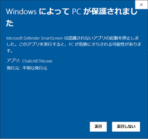

# chakinet-lite
## 最新ビルドを試用する方法（インストーラは使用しません）
- Actions(https://github.com/chakidev/chakinet-lite/actions) ページに行き、最新ビルドを選択します。（上にある方が新しい）
    
- Artifactsセクションのbuild-resultをクリックするとzipファイルのダウンロードが開始されます。
    
- zipの内容を適当なフォルダに展開し、chakinet-lite.exe を実行します。
  - フォルダの内容は展開前にクリアすることを推奨します。
  - インストーラでなくネットからダウンロードしたファイルを直接実行することになるため、「WindowsによってPCが保護されました」というダイアログが出ますが、「詳細」をクリックすれば下記の画面になりますので、実行できるようになります。
    
